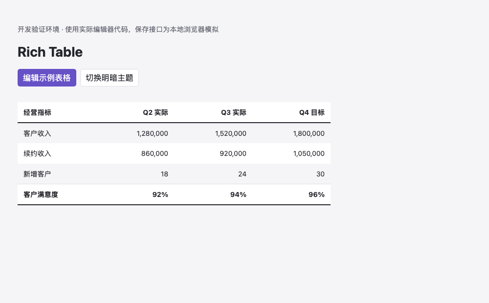
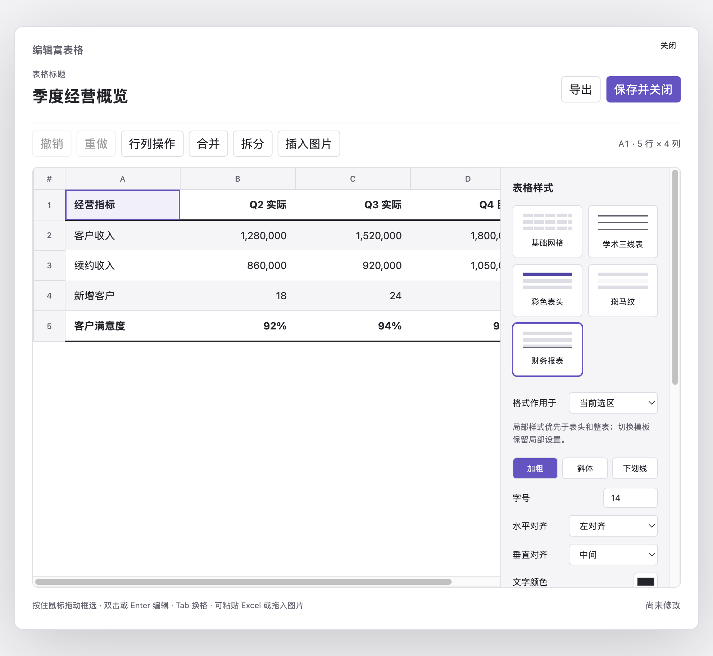
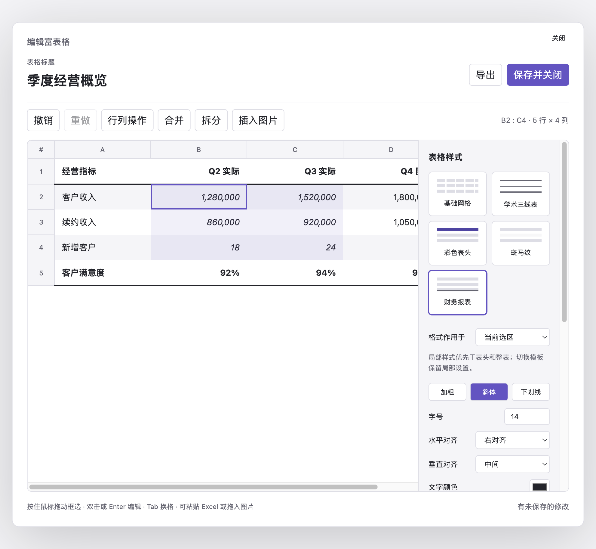

# Rich Table · Obsidian 富表格

面向 Obsidian 桌面端的可视化富表格插件。表格直接嵌入笔记，点击“编辑”即可打开独立编辑窗口，支持 Excel 区域粘贴、单元格图片、模板与样式调整。

当前可安装体验版：**0.1.3**，作者 **zy**。声明最低 Obsidian 版本 **1.8.7**，仅桌面端。构建和自动化测试通过，Obsidian 实机完整使用流程尚未验证，详见 [验证记录](docs/verification.md)。

## 界面预览

### 阅读视图

表格以结构化内容直接呈现在笔记中，支持表头、对齐、边框、隔行底色等样式。



### 可视化编辑器

独立编辑窗口集中提供行列操作、合并拆分、图片、导出、模板及样式设置。



### 选区与局部样式

可框选连续单元格区域，并将文字格式、对齐、颜色和边框应用到当前选区。



## 安装

1. 解压 `dist/obsidian-rich-table-0.1.3.zip`，得到 `obsidian-rich-table` 文件夹。
2. 将整个文件夹复制到目标 Vault 的 `.obsidian/plugins/` 下。若使用自定义配置文件夹，则替换 `.obsidian`。macOS Finder 可按 `⌘⇧.` 显示隐藏文件夹。
3. 确认以下三个文件直接位于插件文件夹内，避免多套一层目录：

   ```text
   你的 Vault/
   └── .obsidian/
       └── plugins/
           └── obsidian-rich-table/
               ├── main.js
               ├── manifest.json
               └── styles.css
   ```

4. 重新打开 Obsidian，在“设置 → 第三方插件”中启用 **Rich Table**；如果当前开启受限模式，需先允许使用第三方插件。
5. 打开一篇 Markdown 笔记，通过以下任一入口创建：
   - 在新行或空白后输入 `/`，选择“插入富表格”。
   - 点击左侧栏的表格图标。
   - 通过命令面板搜索 **Rich Table: 插入富表格**。
6. 选择行列数与模板，点击“创建表格”。

插件目录是 Obsidian 启动时扫描的。如果在 Obsidian 运行期间手动安装或覆盖版本，需要完全退出并重新打开，或先关闭再开启 Rich Table，才会载入新的 `main.js`。

本项目没有修改你的现有 Vault。项目内 `test-vault` 是独立体验库，也可以通过 Obsidian 的“打开本地仓库”选择它。安装包中的 `examples/富表格示例.md` 可复制到任意已启用插件的 Vault 中体验。

## 使用

表格在阅读视图中显示；实时预览下，光标进入代码块可能显示源数据，移出后显示表格。点表格右上角“编辑”进入编辑窗口。

| 操作 | 用法 |
| --- | --- |
| 快速创建 | 在行首或空白后输入 `/`，选择“插入富表格”；网址及连续路径中的 `/` 不触发 |
| 鼠标框选 | 按住左键从起始格拖到目标格，松开后保留矩形选区，再点击合并、拆分或格式按钮 |
| 输入文字 | 双击单元格，或选中后按 Enter / F2；编辑状态下 Enter 换行 |
| 完成当前格编辑 | Tab 切换下一格；Shift+Tab 返回上一格；⌘/Ctrl+Enter 或 Escape 留在当前格 |
| 选区 | 单击选格，Shift+单击或 Shift+方向键扩选；点击行号、列号选择整行、整列 |
| 全选 | 网格获得焦点时按 ⌘/Ctrl+A |
| 粘贴 Excel | 复制 Excel 中的单元格区域，选中起始格后粘贴；超出表格时自动扩展 |
| 新增行列 | 选中单元格后点击“新增行”或“新增列”，默认在下方或右侧插入并选中新位置 |
| 更多行列操作 | 点击“更多”或右键单元格，可在上/下方插行、左/右侧插列及删除选中行列 |
| 合并、拆分 | 选择矩形区域后点击“合并”或“拆分” |
| 列宽 | 拖动列标题右边缘，或在右侧面板输入宽度 |
| 样式 | 右侧选择作用范围：当前选区、首行表头或整表，再调整字体、底色、对齐和边框 |
| 图片 | “插入图片”、拖入本地图片，或粘贴剪贴板中的图片文件；右侧可调整宽度和移除 |
| 撤销、重做 | 工具栏按钮，或非文字编辑状态下 ⌘/Ctrl+Z、⌘/Ctrl+Shift+Z |
| 保存 | “保存并关闭”或 ⌘/Ctrl+S；未保存关闭时可继续编辑、放弃或保存 |
| 导出 | 编辑窗口右上角“导出”，选择 HTML、Markdown 或 JSON |

五种模板：基础网格、学术三线表、彩色表头、斑马纹、财务报表。切换模板保留内容及局部格式；想恢复纯模板效果，可使用“清除自定义样式”。

合并时按从上到下、从左到右的顺序保留文字和图片，文字之间加换行。拆分后内容留在左上格；若想恢复合并前的分布，应使用撤销。

Excel 粘贴保留文本、空格子、换行、前导零和支持的合并结构。公式按剪贴板显示值处理，不执行计算；不导入 Excel 的完整样式、图片对象或工作簿，也不直接打开 `.xlsx`。

## 内容保存与导出

每张表保存在当前 `.md` 笔记的 `rich-table` 代码块内，包含版本号、独立 ID、内容和样式。插件设置仅存默认行列数及模板；无需账号或网络服务。停用插件后，笔记保留 JSON 源数据。

编辑窗口内的改动在保存时写回。保存会核对原表，笔记其他段落变化不影响定位；同一表被外部修改、删除或出现重复 ID 时会停止覆盖，并保留编辑草稿。可先导出 JSON，再处理冲突。JSON 可用于备份，恢复时将其内容放入一个 `rich-table` 代码块；同一笔记中不要保留重复 ID 的表格。

图片写入 Vault 的附件目录，代码块记录相对路径。删除图片引用、撤销、放弃编辑或导入中途失败都不会自动清理已写入附件。移动或重命名附件后，需同步修改代码块中的路径，首版不自动跟踪附件改名。

- **HTML**：保留受支持样式及合并结构，使用浅色导出样式；图片保持相对链接。分享时应把 HTML 放到与 Vault 根目录等价的位置，并按相同路径携带附件。
- **Markdown**：保留文本及图片链接，移除样式和合并结构；合并内容放在左上格，其他位置留空，第一行作为表头。
- **JSON**：完整保留表格草稿及图片路径，不内嵌附件二进制。

## 首版边界

- 上限为 200 行 × 50 列；单格 20 万字符、100 张图片；单张图片 10 MB。最大尺寸的交互性能尚未验证，建议先使用常见的小型报告表格。
- 支持 PNG、JPEG、WebP、GIF；不支持 SVG 和远程图片导入。
- 编辑在独立窗口完成；不包含正文逐格直接编辑、公式计算、排序筛选、数据库关联、协同编辑或移动端支持。
- 有打印样式，但 Obsidian 的 PDF 导出、真实 Excel 剪贴板、实际中文输入法和主题兼容仍需实机验证。
- 撤销记录仅保留当前编辑窗口最近 60 次变更，不跨关闭恢复。

## 开发

使用 Node.js 22+、npm；打包脚本需要系统 `zip` 命令（macOS 已提供）。

```sh
npm ci
npm run build
npm test
npm run package
```

构建生成根目录 `main.js`；ZIP 输出到 `dist/`。源码在 `src/`，测试在 `tests/`，设计与实施说明在 `docs/`。

`dev/` 提供导入真实编辑器代码的浏览器模拟宿主，用于开发交互检查，不能替代 Obsidian 兼容性测试。
